# Design Document: Incident-to-Code Traceability Platform

## Overview

The Incident-to-Code Traceability Platform is a full-stack web application that automatically correlates production incidents with code changes. The system analyzes incident logs, extracts error patterns, and identifies the specific commits, pull requests, and authors responsible for the issue. By integrating with GitHub, Jira, Linear, and Slack, the platform provides a unified dashboard that reduces incident investigation time from hours to under a minute.

### Key Features

- Automated error pattern extraction from incident logs
- Intelligent commit correlation using file paths, function names, and timestamps
- Code diff visualization with highlighted suspect changes
- Pull request and author information retrieval
- Ticket integration (Jira/Linear) for business context
- Chronological incident timeline generation
- Shareable incident reports (PDF, Markdown, URL)
- Multi-repository support for microservice architectures
- Slack notifications for team collaboration
- Analysis history and search capabilities

### Technology Stack

**Backend:**
- Python 3.11+ with FastAPI
- SQLAlchemy ORM with PostgreSQL
- GitHub REST API v3
- Jira REST API v3
- Linear GraphQL API
- Slack Web API

**Frontend:**
- React 18+ with TypeScript
- Vite build tool
- TailwindCSS for styling
- React Router for navigation

**Infrastructure:**
- Vercel (frontend hosting)
- Render/Railway (backend hosting)
- PostgreSQL database

## Architecture

### System Architecture

The platform follows a three-tier architecture:

```
┌─────────────────────────────────────────────────────────────┐
│                      Frontend Layer                          │
│  ┌──────────────┐  ┌──────────────┐  ┌──────────────┐      │
│  │  Dashboard   │  │   History    │  │   Settings   │      │
│  │     UI       │  │     View     │  │     Page     │      │
│  └──────────────┘  └──────────────┘  └──────────────┘      │
└─────────────────────────────────────────────────────────────┘
                            │
                    REST API (HTTPS)
                            │
┌─────────────────────────────────────────────────────────────┐
│                      Backend Layer                           │
│  ┌──────────────┐  ┌──────────────┐  ┌──────────────┐      │
│  │   Incident   │  │ Correlation  │  │  Timeline    │      │
│  │   Analyzer   │  │   Service    │  │  Generator   │      │
│  └──────────────┘  └──────────────┘  └──────────────┘      │
│  ┌──────────────┐  ┌──────────────┐  ┌──────────────┐      │
│  │ Diff Engine  │  │ Integration  │  │   Report     │      │
│  │              │  │     Hub      │  │  Generator   │      │
│  └──────────────┘  └──────────────┘  └──────────────┘      │
└─────────────────────────────────────────────────────────────┘
                            │
                    API Calls (HTTPS)
                            │
┌─────────────────────────────────────────────────────────────┐
│                   External Services Layer                    │
│  ┌──────────────┐  ┌──────────────┐  ┌──────────────┐      │
│  │   GitHub     │  │     Jira     │  │    Linear    │      │
│  │     API      │  │     API      │  │     API      │      │
│  └──────────────┘  └──────────────┘  └──────────────┘      │
│  ┌──────────────┐  ┌──────────────┐                         │
│  │    Slack     │  │  PostgreSQL  │                         │
│  │     API      │  │   Database   │                         │
│  └──────────────┘  └──────────────┘                         │
└─────────────────────────────────────────────────────────────┘
```

### Component Interaction Flow

1. User submits incident logs via the Dashboard UI
2. Incident_Analyzer parses logs and extracts error patterns
3. Repository_Connector fetches recent commits from GitHub
4. Correlation_Service matches error patterns with code changes
5. Diff_Engine retrieves code differences for suspect commits
6. Integration_Hub fetches PR and ticket information
7. Timeline_Generator creates chronological event timeline
8. Results are displayed in the Dashboard UI
9. Report_Generator creates shareable reports
10. Integration_Hub sends Slack notifications

### Data Flow

```mermaid
graph LR
    A[User Input] --> B[Log Parser]
    B --> C[Error Extractor]
    C --> D[Pattern Normalizer]
    D --> E[Commit Fetcher]
    E --> F[Correlation Engine]
    F --> G[Confidence Scorer]
    G --> H[Diff Retriever]
    H --> I[PR/Ticket Fetcher]
    I --> J[Timeline Builder]
    J --> K[Dashboard Display]
    K --> L[Report Generator]
```



## Components and Interfaces

### 1. Incident_Analyzer

**Responsibility:** Parse incident logs and extract structured error patterns.

**Key Methods:**
- `parse_logs(log_content: str, format: str) -> ParsedLog`
- `extract_error_patterns(parsed_log: ParsedLog) -> List[ErrorPattern]`
- `normalize_error_message(error: str) -> str`
- `extract_stack_trace(log_content: str) -> StackTrace`

**Data Structures:**
```python
@dataclass
class ErrorPattern:
    error_type: str  # Exception, HTTP error, DB error
    message: str  # Normalized error message
    file_paths: List[str]  # Extracted file paths
    function_names: List[str]  # Extracted function names
    line_numbers: List[int]  # Line numbers from stack trace
    timestamps: List[datetime]  # Error occurrence times
    raw_stack_trace: str  # Original stack trace

@dataclass
class ParsedLog:
    format: str  # json, syslog, plain
    entries: List[LogEntry]
    metadata: Dict[str, Any]
```

**API Endpoint:**
```
POST /api/incidents/analyze
Request: {
  "log_content": "string",
  "format": "json|syslog|plain",
  "repository_ids": [1, 2, 3]
}
Response: {
  "analysis_id": "uuid",
  "error_patterns": [...],
  "status": "processing"
}
```

### 2. Diff_Engine

**Responsibility:** Retrieve and format code differences between commits.

**Key Methods:**
- `get_commit_diff(repo: str, commit_sha: str) -> CommitDiff`
- `compare_commits(repo: str, base: str, head: str) -> Diff`
- `format_unified_diff(diff: Diff) -> str`
- `detect_file_renames(diff: Diff) -> List[FileRename]`

**Data Structures:**
```python
@dataclass
class CommitDiff:
    commit_sha: str
    files_changed: List[FileDiff]
    additions: int
    deletions: int
    total_changes: int

@dataclass
class FileDiff:
    file_path: str
    old_path: Optional[str]  # For renames
    status: str  # added, modified, deleted, renamed
    additions: int
    deletions: int
    patch: str  # Unified diff format
    language: str  # For syntax highlighting
```

**API Endpoint:**
```
GET /api/diff/{owner}/{repo}/{commit_sha}
Response: {
  "commit_sha": "string",
  "files_changed": [...],
  "total_changes": 150
}
```

### 3. Repository_Connector

**Responsibility:** Manage GitHub integration and data retrieval.

**Key Methods:**
- `authenticate(token: str) -> bool`
- `fetch_repository_metadata(owner: str, repo: str) -> RepoMetadata`
- `fetch_commits(repo: str, since: datetime, until: datetime) -> List[Commit]`
- `fetch_pull_request(repo: str, pr_number: int) -> PullRequest`
- `get_commit_metadata(repo: str, sha: str) -> CommitMetadata`

**Data Structures:**
```python
@dataclass
class CommitMetadata:
    sha: str
    author_name: str
    author_email: str
    timestamp: datetime
    message: str
    files_changed: List[str]
    pr_number: Optional[int]
    pr_title: Optional[str]

@dataclass
class PullRequest:
    number: int
    title: str
    author: str
    reviewers: List[str]
    merged_at: datetime
    linked_issues: List[str]  # Jira/Linear IDs
    url: str
```

**API Endpoint:**
```
POST /api/repositories/connect
Request: {
  "owner": "string",
  "repo": "string",
  "token": "string"
}
Response: {
  "repository_id": 1,
  "name": "string",
  "default_branch": "main"
}
```

### 4. Correlation_Service

**Responsibility:** Match error patterns with code changes and calculate confidence scores.

**Key Methods:**
- `correlate_errors_with_commits(patterns: List[ErrorPattern], commits: List[Commit]) -> List[CorrelationResult]`
- `calculate_confidence_score(pattern: ErrorPattern, commit: Commit) -> float`
- `rank_suspects(results: List[CorrelationResult]) -> List[CorrelationResult]`
- `match_file_paths(pattern_paths: List[str], commit_files: List[str]) -> float`
- `match_function_names(pattern_functions: List[str], diff: str) -> float`

**Scoring Algorithm:**
```python
def calculate_confidence_score(pattern: ErrorPattern, commit: Commit) -> float:
    score = 0.0
    
    # File path matching (40% weight)
    file_match_score = match_file_paths(pattern.file_paths, commit.files_changed)
    score += file_match_score * 0.4
    
    # Function name matching (30% weight)
    function_match_score = match_function_names(pattern.function_names, commit.diff)
    score += function_match_score * 0.3
    
    # Temporal proximity (20% weight)
    time_diff = abs((pattern.timestamps[0] - commit.timestamp).total_seconds())
    temporal_score = max(0, 1 - (time_diff / (7 * 24 * 3600)))  # 7 days window
    score += temporal_score * 0.2
    
    # Line number proximity (10% weight)
    line_match_score = match_line_numbers(pattern.line_numbers, commit.diff)
    score += line_match_score * 0.1
    
    return min(score, 1.0)
```

**Data Structures:**
```python
@dataclass
class CorrelationResult:
    commit: CommitMetadata
    confidence_score: float
    matching_files: List[str]
    matching_functions: List[str]
    explanation: str  # Human-readable reason
```

### 5. Integration_Hub

**Responsibility:** Manage connections to external services (Jira, Linear, Slack).

**Key Methods:**
- `fetch_jira_issue(issue_key: str) -> JiraIssue`
- `fetch_linear_issue(issue_id: str) -> LinearIssue`
- `send_slack_notification(channel: str, message: SlackMessage) -> bool`
- `cache_ticket_data(ticket_id: str, data: Dict) -> None`

**Data Structures:**
```python
@dataclass
class TicketInfo:
    ticket_id: str
    title: str
    description: str
    status: str
    url: str
    source: str  # jira or linear

@dataclass
class SlackMessage:
    channel: str
    text: str
    blocks: List[Dict]  # Rich formatting
    mentions: List[str]  # User IDs to mention
```

### 6. Timeline_Generator

**Responsibility:** Create chronological timelines of incident-related events.

**Key Methods:**
- `generate_timeline(analysis_id: str) -> Timeline`
- `add_commit_events(commits: List[Commit]) -> None`
- `add_pr_events(prs: List[PullRequest]) -> None`
- `add_error_events(patterns: List[ErrorPattern]) -> None`
- `sort_events_chronologically() -> List[TimelineEvent]`

**Data Structures:**
```python
@dataclass
class TimelineEvent:
    timestamp: datetime
    event_type: str  # commit, pr_merge, error, deployment
    title: str
    description: str
    metadata: Dict[str, Any]
    icon: str  # For UI display

@dataclass
class Timeline:
    events: List[TimelineEvent]
    start_time: datetime
    end_time: datetime
```

### 7. Report_Generator

**Responsibility:** Generate shareable incident reports in multiple formats.

**Key Methods:**
- `generate_pdf_report(analysis_id: str) -> bytes`
- `generate_markdown_report(analysis_id: str) -> str`
- `create_shareable_url(analysis_id: str) -> str`
- `render_report_html(analysis: IncidentAnalysis) -> str`

**Report Structure:**
```markdown
# Incident Report: [Error Summary]

## Summary
- Incident ID: [UUID]
- Analysis Date: [Timestamp]
- Repositories: [List]
- Top Suspect: [Commit SHA]

## Error Details
[Error patterns and stack traces]

## Timeline
[Chronological events]

## Suspect Commits
[Top 5 commits with confidence scores and diffs]

## Pull Requests
[PR information and linked tickets]

## Recommendations
[Suggested actions]
```

## Data Models

### Database Schema

```python
class IncidentAnalysis(Base):
    __tablename__ = "incident_analyses"
    
    id = Column(Integer, primary_key=True)
    user_id = Column(Integer, ForeignKey("users.id"))
    analysis_uuid = Column(String(36), unique=True, index=True)
    log_content = Column(Text)
    log_format = Column(String(20))
    status = Column(String(20))  # processing, completed, failed
    created_at = Column(DateTime, default=datetime.utcnow)
    completed_at = Column(DateTime, nullable=True)
    
    # Relationships
    repositories = relationship("AnalysisRepository", back_populates="analysis")
    error_patterns = relationship("ErrorPattern", back_populates="analysis")
    suspect_commits = relationship("SuspectCommit", back_populates="analysis")
    timeline = relationship("TimelineEvent", back_populates="analysis")

class AnalysisRepository(Base):
    __tablename__ = "analysis_repositories"
    
    id = Column(Integer, primary_key=True)
    analysis_id = Column(Integer, ForeignKey("incident_analyses.id"))
    repository_id = Column(Integer, ForeignKey("repositories.id"))
    
    analysis = relationship("IncidentAnalysis", back_populates="repositories")
    repository = relationship("Repository")

class Repository(Base):
    __tablename__ = "repositories"
    
    id = Column(Integer, primary_key=True)
    user_id = Column(Integer, ForeignKey("users.id"))
    owner = Column(String(255))
    name = Column(String(255))
    default_branch = Column(String(100))
    github_token_encrypted = Column(Text)
    last_synced = Column(DateTime, nullable=True)
    created_at = Column(DateTime, default=datetime.utcnow)

class ErrorPattern(Base):
    __tablename__ = "error_patterns"
    
    id = Column(Integer, primary_key=True)
    analysis_id = Column(Integer, ForeignKey("incident_analyses.id"))
    error_type = Column(String(100))
    message = Column(Text)
    file_paths = Column(JSON)  # List of file paths
    function_names = Column(JSON)  # List of function names
    line_numbers = Column(JSON)  # List of line numbers
    timestamps = Column(JSON)  # List of timestamps
    raw_stack_trace = Column(Text)
    
    analysis = relationship("IncidentAnalysis", back_populates="error_patterns")

class SuspectCommit(Base):
    __tablename__ = "suspect_commits"
    
    id = Column(Integer, primary_key=True)
    analysis_id = Column(Integer, ForeignKey("incident_analyses.id"))
    repository_id = Column(Integer, ForeignKey("repositories.id"))
    commit_sha = Column(String(40))
    author_name = Column(String(255))
    author_email = Column(String(255))
    commit_message = Column(Text)
    commit_timestamp = Column(DateTime)
    confidence_score = Column(Float)
    matching_files = Column(JSON)
    matching_functions = Column(JSON)
    pr_number = Column(Integer, nullable=True)
    pr_title = Column(String(500), nullable=True)
    
    analysis = relationship("IncidentAnalysis", back_populates="suspect_commits")
    repository = relationship("Repository")

class TimelineEvent(Base):
    __tablename__ = "timeline_events"
    
    id = Column(Integer, primary_key=True)
    analysis_id = Column(Integer, ForeignKey("incident_analyses.id"))
    timestamp = Column(DateTime)
    event_type = Column(String(50))
    title = Column(String(500))
    description = Column(Text)
    metadata = Column(JSON)
    
    analysis = relationship("IncidentAnalysis", back_populates="timeline")

class ShareableReport(Base):
    __tablename__ = "shareable_reports"
    
    id = Column(Integer, primary_key=True)
    analysis_id = Column(Integer, ForeignKey("incident_analyses.id"))
    share_uuid = Column(String(36), unique=True, index=True)
    created_at = Column(DateTime, default=datetime.utcnow)
    expires_at = Column(DateTime)  # 30 days from creation
    access_count = Column(Integer, default=0)
```


## Correctness Properties

*A property is a characteristic or behavior that should hold true across all valid executions of a system—essentially, a formal statement about what the system should do. Properties serve as the bridge between human-readable specifications and machine-verifiable correctness guarantees.*


### Property Reflection

After analyzing all acceptance criteria, I've identified several areas of redundancy:

1. **Repository metadata fields (2.2, 2.4, 2.5)**: These can be combined into a single property about data completeness
2. **Ticket integration (8.1, 8.2)**: Jira and Linear ticket retrieval can be combined into one property about ticket data
3. **Timeline event inclusion (9.2, 9.3, 9.4, 9.5)**: These can be combined into one property about timeline completeness
4. **Report content requirements (10.1-10.5)**: These can be combined into one property about report completeness
5. **Export formats (10.6, 10.7)**: These can be combined into one property about export functionality
6. **Filtering operations (13.5, 13.6, 13.7)**: These can be combined into one property about filtering correctness
7. **Slack message content (15.2, 15.3, 15.4, 15.7)**: These can be combined into one property about message completeness
8. **Error message properties (18.1, 18.2, 18.3, 18.6)**: These can be combined into one property about error message quality
9. **Caching behavior (8.6, 17.3)**: These can be combined into one property about cache correctness
10. **UI examples**: Many UI-specific examples don't need separate properties as they're testing the same rendering logic

After reflection, I've consolidated 126 acceptance criteria into 45 unique, non-redundant properties.

### Property 1: Diff Engine Input Acceptance

*For any* two commit identifiers (valid or invalid format), the Diff_Engine should accept them as input without throwing an exception during the input validation phase.

**Validates: Requirements 1.1**

### Property 2: Diff Retrieval Completeness

*For any* pair of valid commit identifiers in a repository, the Diff_Engine should return diff data that includes all files changed between those commits.

**Validates: Requirements 1.2**

### Property 3: Unified Diff Format Compliance

*For any* diff output from the Diff_Engine, the output should conform to unified diff format with line numbers for each change hunk.

**Validates: Requirements 1.3**

### Property 4: Change Type Indicators

*For any* diff output, added lines should be prefixed with '+', removed lines with '-', and the output should contain these distinct markers.

**Validates: Requirements 1.4**

### Property 5: Rename Detection

*For any* commit that includes file renames, the Diff_Engine should detect and indicate the rename operation in the diff output.

**Validates: Requirements 1.5**

### Property 6: File Type Support

*For any* text-based file type (identified by extension), the Diff_Engine should successfully generate a diff without errors.

**Validates: Requirements 1.6**

### Property 7: Diff Error Handling

*For any* invalid commit identifier or inaccessible commit, the Diff_Engine should return an error response containing a descriptive message rather than throwing an unhandled exception.

**Validates: Requirements 1.7**

### Property 8: Repository Metadata Completeness

*For any* successfully connected repository, the retrieved metadata should include name, owner, default branch, and all commits should include author, timestamp, message, and changed files.

**Validates: Requirements 2.2, 2.5**

### Property 9: Commit Time Window

*For any* repository connection, all fetched commits should have timestamps within the past 30 days from the connection time.

**Validates: Requirements 2.3**

### Property 10: Pull Request Data Completeness

*For any* retrieved pull request, the data should include title, author, merge status, and linked issues (even if empty).

**Validates: Requirements 2.4**

### Property 11: Credential Encryption

*For any* repository connection credentials stored in the database, the credentials should be encrypted (not stored in plaintext).

**Validates: Requirements 2.7**

### Property 12: Log Format Support

*For any* log input in plain text, JSON, or syslog format, the Incident_Dashboard should accept it without rejection during format validation.

**Validates: Requirements 3.2, 4.7**

### Property 13: Formatting Preservation

*For any* log input containing line breaks and whitespace, the stored content should preserve those line breaks and whitespace characters.

**Validates: Requirements 3.3**

### Property 14: Size Limit Validation

*For any* log input exceeding 10MB or text input exceeding the maximum character limit, the system should reject the input with a warning message.

**Validates: Requirements 3.6**

### Property 15: Input Validation

*For any* log input that is empty or contains only whitespace, the system should reject it with a validation error before submission.

**Validates: Requirements 3.7**

### Property 16: Error Message Extraction

*For any* log containing error messages (exceptions, HTTP errors, or database errors), the Incident_Analyzer should extract at least one error message.

**Validates: Requirements 4.1, 4.4**

### Property 17: Stack Trace Parsing

*For any* log containing a valid stack trace, the Incident_Analyzer should extract file paths, function names, and line numbers from that stack trace.

**Validates: Requirements 4.2**

### Property 18: Timestamp Extraction

*For any* log entry containing timestamps in standard formats, the Incident_Analyzer should extract those timestamps.

**Validates: Requirements 4.3**

### Property 19: Error Normalization Consistency

*For any* two error messages that differ only in variable values or timestamps, the normalized versions should be identical.

**Validates: Requirements 4.5**

### Property 20: Commit Retrieval Time Window

*For any* error pattern extraction, all commits retrieved for correlation should have timestamps within 7 days before the error occurrence.

**Validates: Requirements 5.1**

### Property 21: File Path Matching

*For any* error pattern containing file paths and any commit modifying those same file paths, the Correlation_Service should identify that commit as a match.

**Validates: Requirements 5.2**

### Property 22: Function Name Matching

*For any* error pattern containing function names and any commit whose diff includes changes to those function names, the Correlation_Service should identify that commit as a match.

**Validates: Requirements 5.3**

### Property 23: Confidence Score Bounds

*For any* commit correlation result, the confidence score should be a value between 0.0 and 1.0 inclusive.

**Validates: Requirements 5.4**

### Property 24: Confidence Score Ordering

*For any* list of correlation results, the results should be sorted in descending order by confidence score (highest confidence first).

**Validates: Requirements 5.5**

### Property 25: Result Limit

*For any* correlation analysis, the returned list of suspect commits should contain at most 5 commits.

**Validates: Requirements 5.6**

### Property 26: File Display Prioritization

*For any* commit with multiple changed files where some files match error patterns, the matching files should appear before non-matching files in the display order.

**Validates: Requirements 6.6**

### Property 27: Timezone Conversion

*For any* commit timestamp displayed to a user, the timestamp should be converted to the user's local timezone.

**Validates: Requirements 7.2**

### Property 28: Ticket Data Completeness

*For any* successfully retrieved ticket (Jira or Linear), the ticket data should include title, description, status, and URL.

**Validates: Requirements 8.1, 8.2**

### Property 29: Cache Correctness

*For any* ticket or commit data, if the same data is requested within the cache duration (1 hour for tickets, 5 minutes for commits), the cached version should be returned without making a new API call.

**Validates: Requirements 8.6, 17.3**

### Property 30: Timeline Completeness

*For any* completed incident analysis, the generated timeline should include all commit events, PR merge events, error occurrence events, and deployment events (when available).

**Validates: Requirements 9.1, 9.2, 9.3, 9.4, 9.5**

### Property 31: Timeline Chronological Ordering

*For any* generated timeline, all events should be sorted in chronological order by timestamp (earliest first).

**Validates: Requirements 9.6**

### Property 32: Report Content Completeness

*For any* generated traceability report, the report should include incident summary, timeline, suspect commits with diffs and confidence scores, PR information, linked tickets, and author contact information.

**Validates: Requirements 10.1, 10.2, 10.3, 10.4, 10.5**

### Property 33: Export Format Validity

*For any* report export, the PDF export should produce valid PDF format and the Markdown export should produce valid Markdown format.

**Validates: Requirements 10.6, 10.7**

### Property 34: Shareable URL Uniqueness and Expiration

*For any* two generated shareable URLs, they should be unique, and each URL should have an expiration date exactly 30 days from creation.

**Validates: Requirements 10.8**

### Property 35: Unauthenticated Report Access

*For any* valid shareable URL that has not expired, accessing it should display the report without requiring authentication.

**Validates: Requirements 10.9**

### Property 36: Real-time Update Delivery

*For any* analysis in progress, the dashboard should receive status updates as the analysis progresses through different stages.

**Validates: Requirements 11.6**

### Property 37: Session Persistence

*For any* repository selection made by a user, that selection should persist for the duration of the user session.

**Validates: Requirements 12.4**

### Property 38: Data Retention Period

*For any* completed analysis, it should be stored and accessible for 90 days, and should be deleted after 90 days.

**Validates: Requirements 13.1**

### Property 39: History Filtering Correctness

*For any* filter applied to analysis history (by repository, date range, or search query), all returned results should match the filter criteria.

**Validates: Requirements 13.5, 13.6, 13.7**

### Property 40: Multi-Repository Search Completeness

*For any* analysis with multiple repositories selected, the correlation results should include commits from all selected repositories.

**Validates: Requirements 14.2**

### Property 41: Multi-Repository Timeline Completeness

*For any* analysis with multiple repositories, the timeline should include events from all selected repositories.

**Validates: Requirements 14.7**

### Property 42: Confidence Score Normalization

*For any* multi-repository analysis, confidence scores should be normalized such that scores are comparable across different repositories.

**Validates: Requirements 14.5**

### Property 43: Slack Notification Completeness

*For any* completed analysis with Slack notifications enabled, the Slack message should include the top suspect commit, a link to the full report, rich formatting with code blocks, and user mentions for commit authors.

**Validates: Requirements 15.1, 15.2, 15.3, 15.4, 15.7**

### Property 44: Notification Failure Resilience

*For any* analysis where Slack notification fails, the analysis should still complete successfully and the failure should be logged.

**Validates: Requirements 15.6**

### Property 45: Authentication Requirement

*For any* request to access incident analysis features (except shareable URLs), the request should be rejected if the user is not authenticated.

**Validates: Requirements 16.1**

### Property 46: Session Expiration

*For any* user session, the session should expire and become invalid exactly 24 hours after creation.

**Validates: Requirements 16.4**

### Property 47: Repository Access Authorization

*For any* user attempting to access a repository, access should be granted only if the repository belongs to that user.

**Validates: Requirements 16.6**

### Property 48: Diff Size Limiting

*For any* file diff exceeding 10,000 lines, the diff should be truncated to 10,000 lines to prevent memory issues.

**Validates: Requirements 17.6**

### Property 49: Error Message Quality

*For any* error condition (authentication failure, repository not found, parsing failure), the error message should be descriptive, include relevant context (like repository name), and not expose technical details like stack traces to end users.

**Validates: Requirements 18.1, 18.2, 18.3, 18.6**

### Property 50: External Service Failure Resilience

*For any* analysis where external service integration (Jira, Linear, Slack) fails, the analysis should continue and complete without those services.

**Validates: Requirements 18.5**

### Property 51: Error Logging Completeness

*For any* unexpected error during analysis, the full error details including stack trace should be logged to the system logs for debugging.

**Validates: Requirements 18.7**

