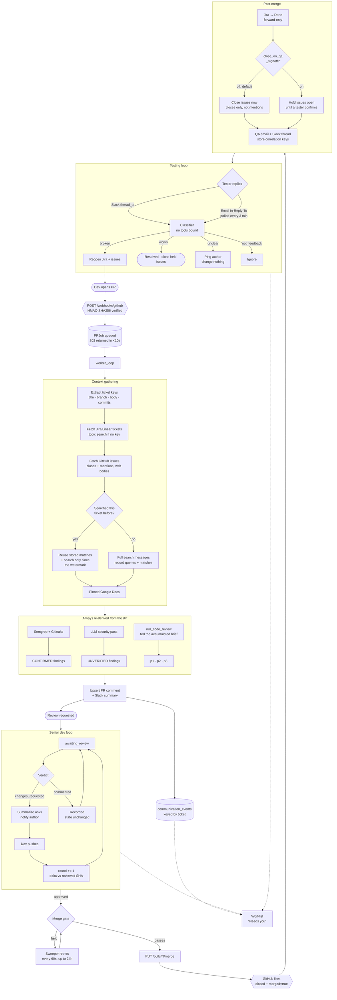
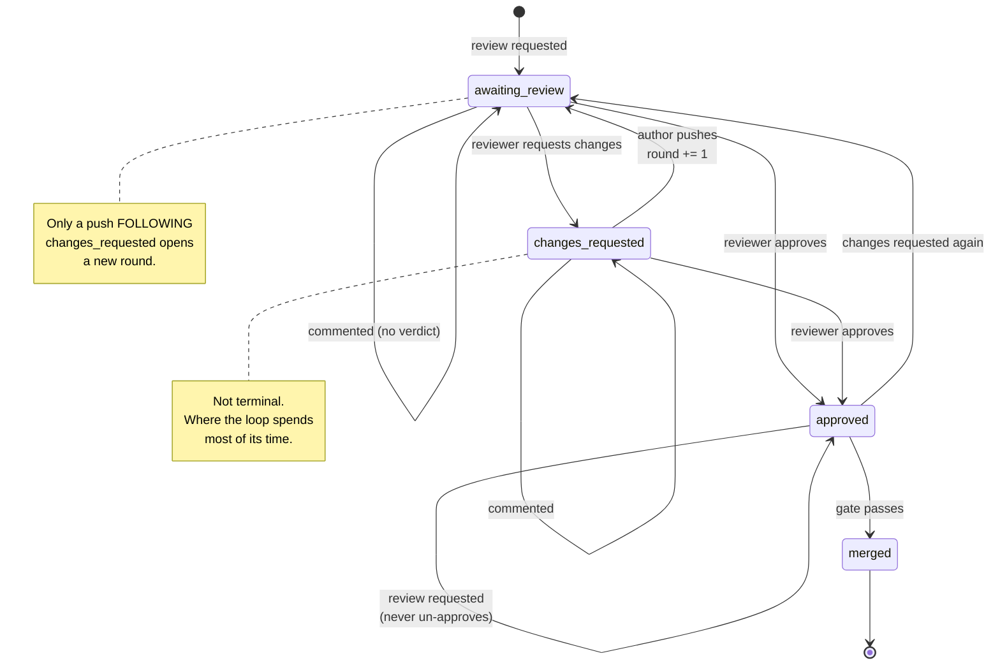
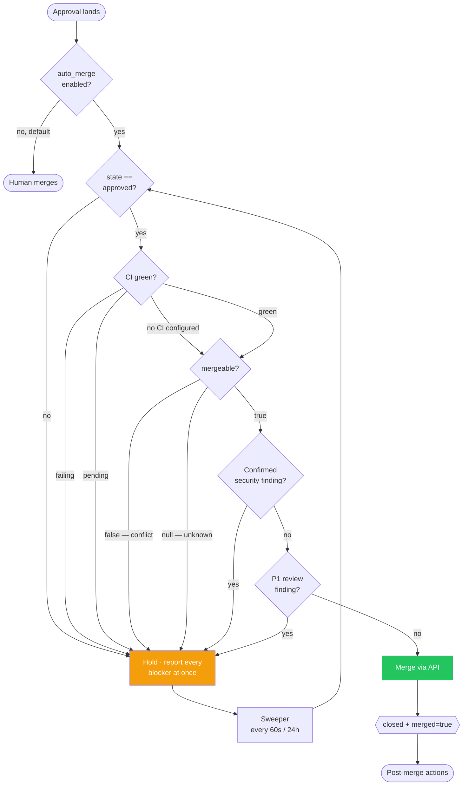
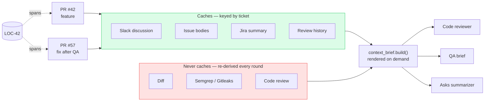

# Workflow

How a change moves through Locus, from a pull request opening to a tester
signing it off.

These diagrams render natively on GitHub. They describe what is built, not what
is planned — see [IMPLEMENTATION_PLAN.md](../IMPLEMENTATION_PLAN.md) for the
latter.

---

## The full lifecycle

Slack is not re-searched from scratch on every run. `comms_log.cached_search`
returns the stored matches plus a watermark, and only messages newer than it are
fetched — so a discussion that happened between two runs is picked up, without
paying for the whole search again. There is no expiry: discussion that was
relevant an hour ago is still relevant now.

The merge is performed through GitHub's API rather than by calling the
post-merge code directly. GitHub then fires the same `closed` + `merged=true`
webhook a human merge would, so there is one post-merge path rather than two to
keep in sync.

---

## Review states

Three rules are deliberate:

- **Only a push after a changes-requested review opens a round.** A push to a
  PR nobody has reviewed is ordinary development; counting it would turn the
  round number into a commit counter.
- **A `commented` review moves nothing.** It carries no verdict, and letting
  drive-by remarks bump the count would make a converging review look stuck.
- **A review request never un-approves.** Asking for a second opinion is
  normal; silently dropping the approval would make a merge-ready PR look
  blocked.

---

## The merge gate

Auto-merge is **off by default**. It is the only path that writes to a default
branch with no human in the loop.

An approval means "the change is right" — not that CI passed. The reviewer may
not have looked, and on a fast-moving PR the checks may not have finished when
they clicked, so every gate is checked independently of the approval.

**Unverified findings and p2/p3 deliberately do not block.** Blocking on a
model's opinion would make the feature unusable, and would hand an unverified
finding the authority the confirmed/unverified split exists to deny it.

**The gate is retried, not evaluated once.** GitHub computes mergeability
lazily: the first read after any change returns `null`, and the approval
webhook fires within a second of the click. Without the sweeper, the common
case is an approved PR that never merges. Held retries stay silent — the reason
was reported when the approval landed.

---

## What caches and what does not

PR #57 inherits PR #42's discussion — including the QA rejection that caused it
to exist — and shares its **Google Doc**, since the report belongs to the work
item rather than to any one pull request. What it never inherits is **findings**. Reusing an analysis across a round would
report round one's scan against round two's code, so a vulnerability introduced
while fixing something else would pass unreported.

`context_brief.build()` takes the current run's analysis as an argument and
never reads a stored one, which is what enforces that split.

---

## Inbound correlation

Nothing is captured on receipt. Each path establishes relevance
deterministically before storing anything:

| Path | Transport | How relevance is proven |
|---|---|---|
| Slack search results | `search.messages`, incremental from a watermark | The query contained the ticket key or PR number |
| Slack QA reply | Events API webhook, sub-second | `thread_ts` matches a thread Locus posted |
| Email QA reply | Gmail polled every 3 min | `In-Reply-To` matches a `Message-ID` Locus set when sending |
| Review verdict | `pull_request_review` webhook | GitHub supplies the PR directly |

Gmail is polled rather than pushed because its `users.watch` registration
expires every seven days and needs a renewal job regardless — at which point
polling is the simpler mechanism.

Threads stop being watched after 14 days: a reply weeks after a merge is almost
certainly about something else.
